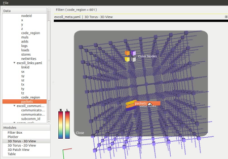
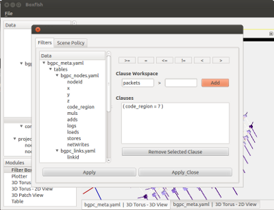
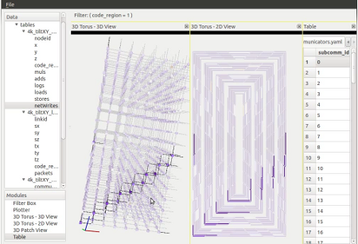

Writing Modules
===============
Each Boxfish module is formed of an agent and a view. Agents descend from the
class ModuleAgent. Views must be wrapped in the class ModuleFrame. To register the
module with the Boxfish root, the ModuleFrame must be annotated with the
``@Module`` decorator. This allows abstract agents and views to be created but
not offered in the user interface.

The agent maintains the connection between parent and child module and manages
data requests and scene policy application. The bulk of this is handled by the
ModuleAgent parent class. The view presents its requested data and handles the
user interface. The frame is aware of the agent and can pass data requests to
it. The agent is not aware of the frame or view -- the frame or viewmust
connect to the signals sent by the agent. The ModuleFrame class handles
initial setup of the module, re-parenting of the module's frame, and
interpreting of drag and drop data. Developers will need to write the rest of
the functionality.

Writing the Agent
-----------------

The agent must be a subclass of ``ModuleAgent`` and have the ``__init__``
signature as shown. This will be expected by the view.::

  class MyModuleAgent(ModuleAgent):

    def __init__(self, parent, datatree):
      super(MyModuleAgent, self).__init__(parent, datatree)

The constructor is a good place to add any Requests the module will have. A
Request is a tagged logical grouping of data flow.  Modules up the tree from
any module instance may manipulate Requests by applying filters. Data
attributes can be associated with Requests and queried on demand. Having tags
allows the user to differentiate between multiple Requests made by the same
module (e.g. some modules have one for nodes and one for links).

To create a Request stream, use ``self.addRequest(tag)``.::

  def __init__(self, parent, datatree):
    super(MyModuleAgent, self).__init__(parent, datatree)

    self.addRequest("descriptive tag")

Data attributes can be added to a Request as a list of indices from the
Boxfish DataTree. For now, we write our own function to accept such a list
from the GUI and then automatically update the data we have to reflect the new
indices. We put the functionality to request and process the data in
``presentData()``.

Later this may be made significantly simpler.::

  class MyModuleAgent(ModuleAgent):

    presentDataSignal = PySide.QtCore.Signal(type_of_processed_data)
  
    def __init__(self, parent, datatree):
      super(MyModuleAgent, self).__init__(parent, datatree)

      self.addRequest("descriptive tag")
      self.requestUpdatedSignal.connect(self.presentData)

    def addDataIndices(self, indexList):
      self.requestAddIndices("descriptive tag", indexList)

    @PySide.QtCore.Slot(str)
    def presentData(self, tag):
      tables, runs, ids, attribute_names, data_lists \
        = self.requestGetRows("descriptive tag")
    
      # Process data here ...
    
      self.presentDataSignal.emit(processed_data)

Here ``presentData`` uses the ``ModuleAgent`` function ``requestGetRows(tag)``
to get all of the table values, row by row, associated with the tag. Which
values will be determined by which indices were passed to
``requestAddIndices``. For now, any indices passed to ``requestAddIndices``
clobber any existing ones.

Note the ``PySide.QtCore.Slot`` before ``presentData``. This indicates that
``presentData`` is triggered by a signal from ``PySide/Qt``'s Signal/Slot
mechanism. The signal is ``requestUpdatedSignal`` and is wired in the
``__init__`` using ``connect``. This signal is fired when the Request
determines something has changed, like the Request indices (attribute columns)
or the filters to be applied. It optionally passes a string -- the name of the
Request. This is passed to the ``tag`` paramter of ``presentData``.

Just as ``presentData`` is triggered by a signal, it also emits one at the
end. This is to notify any attached views that the data associated with the
agent has changed and in this case pass along that data.  The agent may have
as many as necessary that pass along any type and any number of objects, but
they must be declared as class variables.::

The ``requestGetRows(tag)`` returns the data columns associated with the
passed indices, after applying any filters from modules up the Boxfish
structure tree. Many modules will want the information from the passed indices
associated with a particular table or domain. To do this we use the
``requestOnDomain`` function. Note that to use this function, the module needs
some way of determining in what table to find its domain information.  This
usually requires querying the meta-information of the run.::

  def addDataIndices(self, indexList):
    self.requestAddIndices("descriptive tag", indexList)
    self.getRunInfo(self.datatree.getItem(indexList[0]).getRun())

  def getRunInfo(self, run):
    if run is not self.run:
      self.run = run
      
      self.my_table = run.getTable(run["meta-info-key-for-table"])

  def presentData(self):
    entity_ids, values = self.requestOnDomain("descriptive tag",
      domain_table = self.my_table,
      row_aggregator = "mean", attribute_aggregator = "max")

    # Process data here ...

    self.presentDataSignal.emit(processed_data)

The view may require more information than just the entity ids to present the
data. This information may also be encoded in the meta information. For
convenience, the ``TableItem`` has a function for creating forward and
backward ``dict`` objects between the table's entity id and a set of its
attributes.::

  def getRunInfo(self, run):
    if run is not self.run:
      self.run = run
      
      self.my_table = run.getTable(run["meta-info-key-for-table"])
      geometry_info = run["meta-info-key-for-geometry"]
      self.id_to_geom, self.geom_to_id \
        = self.my_table.createIdAttributeMaps(geometry_info)

Here the name of the table of interest is under ``meta-info-key-for-table``
and a list of its geometry attributes for display is under
``meta-info-key-for-geometry``. Using this information, two mappings are
created betwen the two for later user. 

Writing the View
----------------
The view must contained in a subclass of ``ModuleFrame`` and must have an
``__init__`` with the shown signature. This is used by Boxfish to create
module instances dynamically.::

  @Module("My Module", MyModuleAgent)
  class MyModuleFrame(ModuleFrame):

    def __init__(self, parent, parent_frame = None, title = None):
      super(MyModuleFrame, self).__init__(parent, parent_frame, title)

      self.agent.presentDataSignal.connect(self.updateView)

    def createView(self):
      my_view = PySide.QtGui.QWidget()

      # Create the GUI/view within my_view

      return my_view

    @PySide.QtCore.Slot(type_of_processed_data)
    def updateView(self, processed_data):

      # Visualize processed_data...

      return
      

Here the decorator ``@Module`` is used to tell Boxfish that this module can be
created by the user. Abstract ``ModuleFrame`` classes may be created and hidden
from the user by omitting this decorator. The first decorator argument is the
display name of the module which will be shown in the Boxfish GUI. The second
is the class name of the agent that should be created for this view. Each view
may have only one agent. There is an optional third argument, the
``ModuleScene`` type which is describe in :ref:`module-scene-label`.

In the constructor, we connect to the Signal ``presentDataSignal`` that we
created in the agent. When that Signal is fired, the view will call its
``updateView`` function to handle it. This function should be decorated as a
PySide/Qt Slot for the type(s) of data it will receive from the Signal.

Each ``ModuleFrame`` must override the ``createView`` function to return its
custom  PySide/Qt widget. This widget contains all of the visualization and
user interface unique to this view. This widget will then be placed in the
module's outer structure (the frame) which manages the interface for moving
this module within the Boxfish tree structure.

When Boxfish DataTree attribute indices are dropped onto a module, the
``droppedDataSignal`` is fired with the list of indices and potentially a tag. 
To handle dropped attributes, a function should be connected to this signal.::

  def __init__(self, parent, parent_frame = None, title = None):
    super(MyModuleFrame, self).__init__(parent, parent_frame, title)

    self.droppedDataSignal.connect(self.droppedData)

    self.agent.presentDataSignal.connect(self.updateView)

  @PySide.QtCore.Slot(list, str)
  def droppedData(self, indexList):
    self.agent.addDataIndices(indexList)

Here we pass it right along to the agent. This works fine for modules with a
single Request stream but is ambiguous for modules with multiple Request
streams. One way of handling this problem is to use a Drag Overlay.

Drag Overlays
-------------

A Drag Overlay is a semitransparent splashscreen which appears over a module
when the user is dragging Boxfish DataTrees over said module. 

   The Drag Overlay for 3D Torus modules.

The Drag Overlay is divided into tagged regions. When data is dropped on a
Drag Overlay, the second parameter in ``droppedDataSignal`` will be the tag
that was associated with the region in which the data was dropped.::

  @PySide.QtCore.Slot(list, str)
  def droppedData(self, indexList, tag):
    if tag == "nodes":
      self.agent.addNodeIndices(indexList)
    elif tag == "links":
      self.agent.addLinkIndices(indexList)

To add a Drag Overlay, use ``createDragOverlay(list_of_tags,
list_of_region_labels)``. There is an optional third parameter which takes a
list of ``QPixmap`` icons that should be displayed with the labels on the Drag
Overlay.::

  self.createDragOverlay(["nodes", "links"],
                         ["Color Nodes", "Color Links"],
                         [QPixmap(":/nodes.png"), QPixmap(":/links.png")])

Settings and Controls Tab Dialog
--------------------------------
There may be a lot of settings information associated with any given module.
For example, a module may have default aggregation policies for dropped data,
like summing the information vs. taking the maximum value. Also, all modules
have scene information propagation settings. To save screen space, these
settings and their user interfaces are normally not shown. Instead, the user
may access them by double-clicking in a module to bring up a dialog.

   The Tab Dialog for Filter Box modules.

This is a modal dialog which is re-created on user-request. The base class's
dialog contains a single tab for scene information propagation. Subclasses may
add their own user interfaces as tabs by overriding the ``buildTabDialog``
function in the ``ModuleFrame`` class.::

  def buildTabDialog(self):
    super(MyModuleView, self).buildTabDialog()

    my_tab = MyTab(...)
    my_tab.my_tab_signal.connect(self.handleTab)
    self.tab_dialog.addTab(my_tab, "My Module Settings")

Here we create a new ``MyTab`` which is a ``QWidget``. Most likely the user
interface in the tab will want to send some information back to the view so it
may make appropriate changes. In this example we assumed that ``MyTab`` had a
Signal ``my_tab_signal`` which would send this information, so we connected it
to our own function. Finally, we added the tab to ``self.tab_dialog`` using
``addTab``. The second parameter will be the tab's title text.

The superclass's ``buildTabDialog`` must be called or else the scene
information propagation tab will not be available.

This dialog may also be used for other complex interfaces that need not always
be shown. The Filter Box module uses this dialog for its filter GUI.

.. _selection-propagation-label:

Selection Propagation
---------------------
When one or more entitites is selected in a module, that selection can be
propagated to other modules (or other types of entities within the same
module), depending on the user's settings. 

   All three visualization modules above handling selection propagation. The
   Table module has a subcommunicator selected. This is propagated and
   projected onto the elements of the 3D Torus modules.

Making use of this feature requires the module writer to do things -- 1) alert
the ``ModuleAgent`` of the selection when it occurs within the module; 2)
listen for selections from other modules and process their request.

Alerting the ``ModuleAgent`` is done by calling the agent's
``setHighlights(table_list, run_list, ids_list)`` function. These parameters
are parallel lists, each index denoting the coupled table, run and list of
selected ids. The table and run may be specified either by name or by index
from the ``DataTree``. 

Listening for selections from other modules is done by creating a slot for the
``ModuleAgent``'s ``highlightSceneChangeSignal``. Upon this trigger, the list
of selected ids can be updated by calling ``ModuleAgent``'s
``getHighlightIds`` which given a single table and run (as a string or
``DataTree`` index), will return the list of ids in that table which are
selected. Any projections needed are handled by this function.::

  def __init__(self, parent, datatree):
    super(MyModuleAgent, self).__init__(parent, datatree)

    # ... Module Setup ...

    self.highlightSceneChangedSignal.connect(processHighlights)

  @PySide.QtCore.Slot()
  def processHighlights(self):
    if self.table is None:
      return

    ids = self.getHighlightIds(self.table, self.run)
    self.highlightUpdateSignal.emit(ids)

.. _module-scene-label:

Custom Scene Propagation
------------------------
Some modules propagate module-specific scene information amongst modules of
the same type within a subtree of the Boxfish structure. For example, the 3D
Torus Views can link their transformation information so that they all display
the same rotation and zoom. 

.. figure:: ../images/rotationprop_1.png
   :align: center
   :alt: Custom scene propagation for 3D Torus - 3D View.

   The two 3D Torus modules propgate their rotation information to each other.
   The module on the right has this feature turned off.

To add module-specific linked scene information for a new module, a subclass
of ``ModuleScene`` must be created to hold said information.::

  class MyModuleScene(ModuleScene):

    def __init__(self, agent_type, module_name, my_info = None):
      super(MyModuleScene, self).__init__(agent_type, module_name)

      self.my_info = my_info

The parameters ``agent_type`` and ``module_type`` are required and refer to
the ``ModuleAgent`` subclass in which this scene information is used and the
display name of the module from which it comes. Several different agents and
modules may create the same scene information. Agents may consider the
originating agent type and module of any ``ModuleScene`` object to determine
how to handle the information. 

For example, the ``GLModuleScene`` includes information for 3D transformations
and background color. The Torus 3D View will apply the background color from
any ``GLModuleScene`` object but only apply 3D transformation information from
a ``GLModuleScene`` created by another Torus 3D View.

Each ``ModuleScene`` must implement the ``copy`` function to make a deep copy
of the information it contains. This is because of the way agents handle the
propagation of changed scene information.::

 def copy(self):
   if self.my_info is None:
     return MyModuleScene(self.agent_type, self.module_name)
   else:
     return MyModuleScene(self.agent_type, self.module_name,
       self.my_info.copy())

Classes which use a ``ModuleScene`` should pass the type of ``ModuleScene`` to
the ``@Module`` decorator as the optional third argument. 

