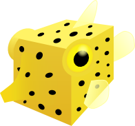

.. Boxfish documentation master file, created by
   sphinx-quickstart on Sun Oct  7 19:04:52 2012.
   You can adapt this file completely to your liking, but it should at least
   contain the root `toctree` directive.

Boxfish Documentation
================================

Boxfish is a platform for visualizing performance data across the domains in
which it was collected. For example, communication groups exist in the domain
of communication but can be viewed on the domain of a system's hardware.
Boxfish enables this operation via a system of projections. Projections are
mappings of objects from one domain (e.g. communication groups) to another
(e.g. hardware processes). Boxfish includes several such common projections
and is designed with the expectation of new projections and visualizations
being contributed. Boxfish handles filtering of data, applications of
projections, and linking of views so that new visualizations may be easily
integrated with existing ones.

Contents
--------

.. toctree::
   :maxdepth: 2

   intro
   userguide
   devguide

Indices and tables
==================

* :ref:`genindex`
* :ref:`modindex`
* :ref:`search`

