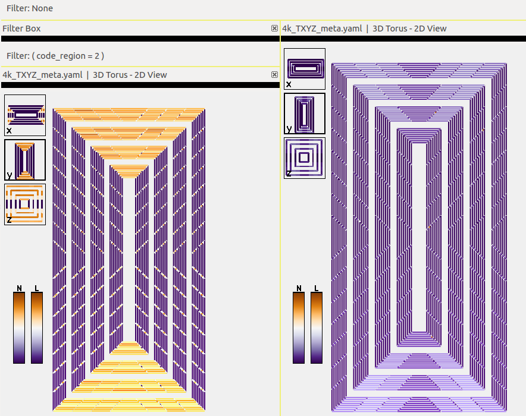
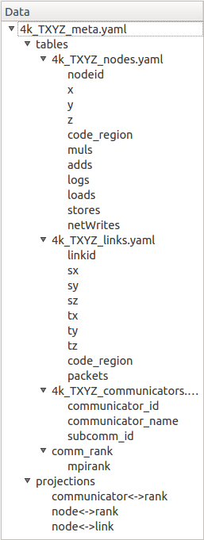

Overview
========

.. _data-relations-label:

Data Relations
--------------

A key concept in Boxfish is the relation of data from different domains and
through those relations, the ability to *project* data both within domains and
from one domain to another. This allows users to apply complex queries that
user information from several domains. It also allows users to select
entities from one domain and see the selection projected onto the entities of
another.

:ref:`domains-label` are the context in which performance data is collected.
Entities in these domains are logical objects with which individual
measurements are associated. :ref:`projections-label` define the relations
between these entities, giving the functionality described above. 

Boxfish Interface
-----------------

The Boxfish interface has three main elements: the data tree (upper left), the
list of available modules (lower left) and the module tree (right). The data
tree provides access to the input tables. Most of the modules interact with
data by having it dragged from the data tree onto the module. 

.. figure:: ../images/dragattributes_1.png
   :align: center
   :scale: 50 %
   :alt: Boxfish user interface.

   Three attributes being dragged from the data tree (upper left) onto a
   module (right). The module list is in the lower left.

The list of available modules provides the ability to launch new module
instances. Dragging an element of this list onto the module tree will create a
new module of that type.

Hierarchy of Modules
--------------------

:ref:`bfmodules` are tools for interacting with, manipulating or visualizing
data in Boxfish. They are organized into a hierarchy, the root of which is a
Filter Box module which is already open upon launch. We refer to this as the
module tree. The purpose of this hierarchy is to group modules into subtrees
that share 1) filters applied to the data they receive; and 2) linking of
their behavior (e.g. displaying the same selection, using the same color maps,
or moving in sync). This allows users to apply filters or selections to many
modules simultaneously.

   The root Filter Box has two children, another Filter Box and a 3D Torus
   module. The second Filter Box has another 3D Torus module as a child. The
   two 3D Torus modules display the same attributes, but the one on the left
   has a filter applied to it.

All modules that fall beneath the title of another module vertically are
progeny of that module. Modules can be re-parented by clicking and dragging on
the module's black bar and dropping the module on the new parent. This can be
a convenient way compare data with and without a filter, or change the view in
one module without changing its siblings. See :ref:`bfmodules` for more
information.

Hierarchy of Data
-----------------

Boxfish expects data that has organized by *run*. A run is a set of data
tables that shares meta-information such as the specifics of the hardware on
which an experiment was run and the settings of the application which was run.
Tables contain the data collected on the run and therefore fall under the run
in the hierarchy. Underneath the tables are *attributes*, labeled columns in
the tables.

Projections that are valid on the run also in the hierarchy, parallel to the
tables. Projections are described in :ref:`projections-label` and summarized
in :ref:`data-relations-label`.

See :ref:`file-format-label` for information on inputting data into Boxfish.

The *data tree*, shown in the upper left of the Boxfish user interface,
displays this data hierarchy so that runs, tables, and projections may be
collapsed and expanded. The table attributes can be dragged over to the
modules to be further explored.

   This data tree has a single run (4k_TXYZ_meta.yaml) with four tables and
   three projections.

