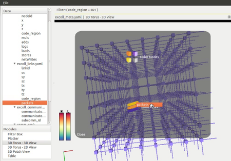
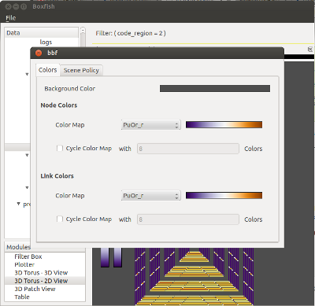
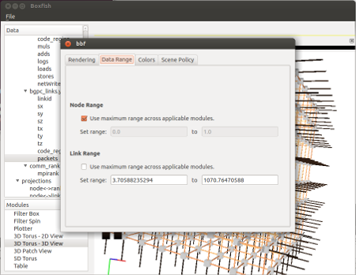
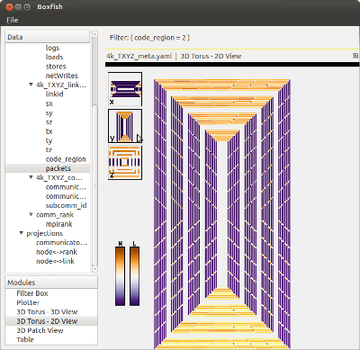

3D Torus Modules
================

The 3D Torus modules present a node-link view of the logical structure of a 3D
Torus based system. The 3D view displays it in 3D space as a rectangular solid
with ragged links representing the wrap-around links in each direction. The 2D
view displays a flattened layout of the nodes with with a subset of the links
minimized or removed to avoid occlusion. Which links are being left out and/or
minimized is selected by the user.

To display attribute information, certain meta-information is required for the
run associated with the attributes. This is required to draw the correct
torus. The following is an example snippet of the run's meta file with this
information:

.. code-block:: yaml

  ---
  key: MY_KEY
  hardware: {
    coords_table = nodes.yaml, # table with node id and coordinate columns
    coords = [x, y, z], # column names of coordinates
    dims = {x: 8, y: 16, z: 16}, # dimensions of torus in each coordinate
    link_coords_table = links.yaml, # table with link id and coordinate columns
    source_coords = {x: sx, y: sy, z: sz}, # source link coordinate mapping
    destination_coords = {x: tx, y: ty, z: tz} # destination link coordinate mapping
  }
  ---

Attributes may be used to color either the nodes or the links. The tab dialog
has color and range controls for nodes and links separately. 

Multiple processes/threads on each node will be aggregated. Forward and
backward data on the links is aggregated by default, but the user can switch
to showing just the positive links (those increasing in a Cartesian direction)
or just the negative links. This feature may be useful when the domain
decomposition follows the torus coordinates.

   When an attribute or set of attributes is dragged onto a 3D Torus module,
   the overlay appears.  Drop the attributes on either nodes or links
   depending on which element type should be colored. 

Shared controls by these two modules are summarized in the following table:

========== ======================
Action     Control
========== ======================
zoom       scroll wheel
translate  meta-key + click-drag
tab dialog double-click
avg. links press "1" (default)
pos. links press "2"
neg. links press "3"
========== ======================

Both modules allow separate color maps and data ranges for nodes and links.
The default option will apply the color map linearly to the attribute values.
Selecting "cycle colors" will sample the color map in the given number of
equally spaced places and then apply that reduced color set to the attribute
values in sequence.  This is useful when the values represent discrete
groupings or clusterings.

Note: If attribute propagation is on and nodes and links share the same
attributes, then one color map will be coerced to the other.

   Color policy for the nodes and links, as well as general background color,
   can be changed through the color tab in each module.

The background color can also be changed. If the modules are set to accept and
propagate module scene information, changing the background color will
propagate to all types of 3D Torus modules.

There are two data range options available. The default option will
automatically set the range to the maximum data extents. If attribute
propagation is on, this will find the maximum extents of all data of the same
attributes within the propagation subtree. The user can also set the data
range manually. Nodes or links with values falling outside the given data
range will not be drawn.

   Data range policy for the nodes and links,
   can be changed through the data range tab in each module.

3D View
-------

The ragged links in the 3D View are drawn from the high extents of the
coordinate space. For example, in an 8x16x16 torus using (x,y,z) coordinates,
the ragged x links will be drawn from any node with first coordinate 7. 

A small set of axes is drawn in the lower left hand corner. This represents
the rotation of the system. The red, green, and blue lines represent the
first, second and third coordinates respectively with the zero coordinates at
the join and the extent coordinates at the end.

Nodes and links in the 3D View that are not displaying data will be drawn
translucently. The tab dialog offers the option of turning off links entirely,
when only the node placement is of interest, and adjusting the node size.

The 3D View specific controls are: 

=============== ======================
Action          Control
=============== ======================
rotate          click-drag
select one node meta-key + right-click
=============== ======================

The 3D View supports selection propagation and rotation/translation/zoom
propagation. 

2D View
-------

The 2D View can be thought of as looking down one axis of 3D space as the
lines of nodes/links in that direction fan out. These lines are compressed and
placed in the plane of the other two axes. Approximately half of the links in
the other two directions are then removed to prevent overlaps. 

Three "minimaps" are shown in the upper left hand corner of the module. They
are small, aggregated representations of the main view for each of the three
axes. Clicking on one will change the main view to a larger version of itself.

   The 2D View of the 3D Torus.

The 2D View supports translation/zoom propagation and  axis propagation. It
will accept selections from other modules. The 2D View specific controls are:

===================== ======================
Action                Control
===================== ======================
change axis           click a minimap
increase edge width   \+
decrease edge width   \-
===================== ======================
