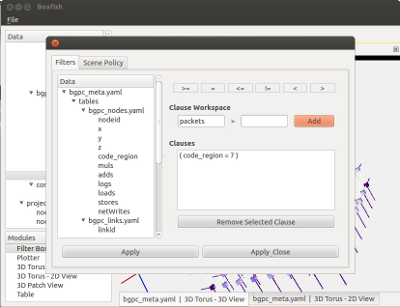

Filter Box
==========

The Filter Box module is the basic interface for applying filters to data
before they visualized or otherwise manipulated by other modules. As such, it
is mostly a pass-through module.  Its effects are applied to child modules
falling under it. All scene settings are supported, but do not affect what is
shown in the Filter Box, only how the scene information is applied to the
child modules.

   Filters can be constructed from the Filter Box's tab dialog. Attributes may
   be dragged from the data tree or typed in manually. Relations are dragged
   from above the Clause Workspace.

Currently the Filter Box supports an arbitrary number of primitive [attribute]
[relation] [value] filters anded together.
