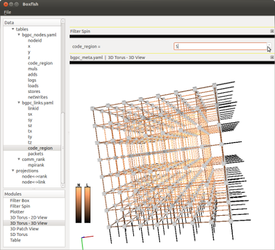

Filter Spin
===========

The Filter Spin module adds a simple spinnable filter of the form [attribute]
= [value]. This is useful for attributes like time where users may want to
step through the values of the attribute in order.

It allows only a single table field as an attribute. The [value] portion in
the spin control, set to allow every value the [attribute] takes (under the
current filters). These values are taken from the Run of the attribute --
values of attributes of the same name but other Runs will not be in the spin
control.

When the spin control is selected (e.g., clicked), the mouse wheel can be used
to change the value. The value may also be manipulated using the spin control
arrows or by typing an existing value.

   The Filter Spin allows users to step through possible values on an
   attribute. The value can be changed with the mouse wheel, arrows, or by
   typing manually.

Like the Filter Box, it is mostly a pass-through module. Its effects are
applied to all child modules falling under it. All scene settings are
supported, but do not affect what is shown in the Filter Spin, only the scene
information applied to the child modules.

**Note**: The Filter Spin does not know the data that the modules below it are
requesting and thus cannot affect the data range. If possible, the user should
fix the data range manually so it is constant over the entire spin.
