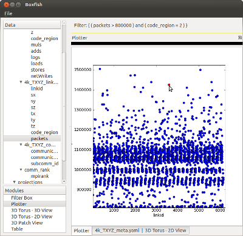

Plotter Module
==============

The plotter supports scatter plots. An arbitrary number of attributes can be
dragged onto the x or y axis. The plotter will project all attributes onto the
domain of the table from which the first x attribute is dragged.

   Plotter module with a single point selected. 

This module supports selection propagation.
