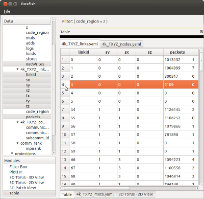

Table Module
============

The table module offers the most direct view into the open table files.
Dragging attributes onto a table will display each attribute as a column in
spreadsheet format. Attributes will be placed into separate tabs based on
which table they come from. 

   Table module with two tabs (for the links and nodes tables) as one row
   selected.

The table module supports selection propagation and thus can be a convenient
way to select and view data in other modules.
