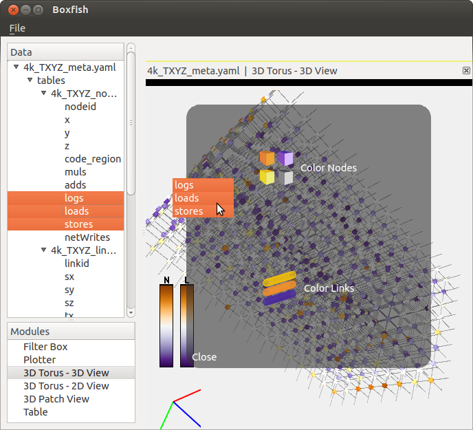
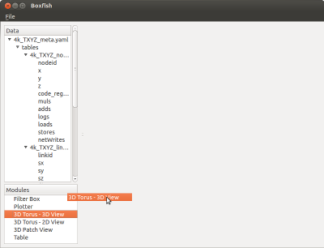
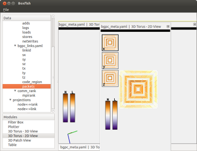
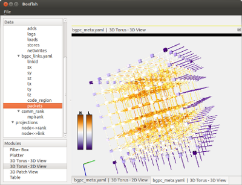
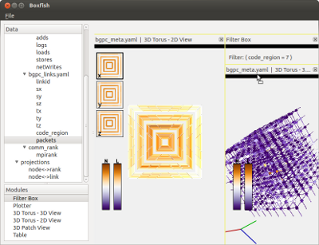
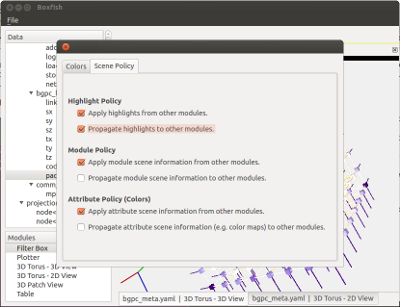
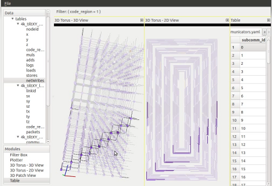
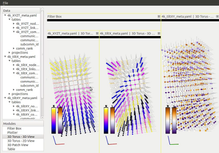

.. _bfmodules:

Modules
=======

Modules in Boxfish are tools for interacting with, manipulating or visualizing
data.

Most modules process data associated with the attributes that are dragged onto
them.

   Three attributes being dragged onto a module.

Boxfish opens with a Filter Box module which will be the ancestor of all other
modules. To start using a module, drag its name from the Module List onto an
existing module. The new module will become a child of the one it was dragged
onto. If that module does not accept children, the new module will become a
child of the first ancestor that accepts children.

   A 3D Torus module being dragged onto the initial Filter Box.

Clicking and dragging the titlebar will allow changing the module's placement
amongst its siblings or hiding it beneath a sibling. Clicking and dragging the
black bar beneath the title bar will allow re-parenting the module to
whichever parent module it is dropped upon.

   Drag from the titlebar to change the position of a module amongst its
   siblings. If released on top of a sibling, it will automatically tabify.

   A 3D Torus - 2D View module is available via a tab below the 3D Torus - 3D
   View module.

   Drag from the black bar and drop the module on a different one to
   re-parent. The new parent module must be a type that accepts children (e.g.
   Filter Box)

.. _policies-label:

Double-clicking on any module will bring up that module's Tab Dialog. This
dialog includes settings and other controls related to the module. Every
module has a Scene Policy tab which determines how actions in this tab affect
other modules and vice versa. For every type of scene information, there are
two properties, propagate and accept.

   The Scene Policy tab. This module accepts highlights, colors and module
   specific information passed to it and propagates highlights to other
   modules.

The propagate property determines whether the scene information will be
propagated to other modules. Once a module sets scene information to
propagate, all of its children will be set to do the same. If you cannot
uncheck this property, it is probably because a parent module has the property
checked. If you want sibling modules to share scene information, check the
propagate property in their parent module.

The accept property determines whether propagated scene information from other
modules will be applied to the current module.

There are three different types of scene information: highlight, module, and
attribute. Highlight scene information includes selected entities in any
module. Propagating highlight information will cause a selection in one module
to project the selection onto other modules.  Module scene information is
module-specific and may be things like the rotation in a 3D visualization
module. In this example, propagation module scene information will cause the
rotation in one module to force the same rotation in all other instances of
that module.

   The top level Filter Box has highlight propagation checked. The first row
   in the Table module is selected and thus all matching elements in the other
   two modules are also selected.

Attribute scene information includes the color maps of sets of attributes.
Modules that have multiple entities which to color (e.g. nodes and links in a
hardware visualization) may have separate scene policies for each of those
entities. Propagating attribute scene information causes the color maps to be
the same for any other set of entities displaying the same set of attributes.
For example, two modules showing packet data will be forced to have the same
color map, but a third module showing load data would not because load is not
the same attribute.

   The second Filter Box has module and attribute propagation checked. The 3D
   Torus modules beneath it share rotation and color maps. (The information is
   different and thus the coloring isn't exactly the same.) The right-most 3D
   Torus module is not beneath that Filter Box and thus does not have linked
   rotation and colors.

Data range information is also propagated by attribute. The default
propagation behavior is using a range which covers data from all modules
displaying those attributes. Some modules may allow setting the range
explicitly.

Note that these propagations will only occur for modules for which these
features are supported. It is up to the module designer to determine which
propagations to support and how to display them.

.. toctree::
   :maxdepth: 2

   mods/filterbox
   mods/filterspin
   mods/3dtorus
   mods/table
   mods/plotter
